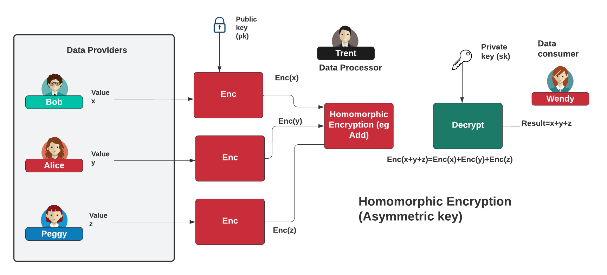

# Masking IP addresses
<<<<<<< HEAD

=======
>>>>>>> 8abe4ac55fd5d3e13215282e42b6955601cb0d29

## Outline
In many areas of cybersecurity, we require access to Personally Identifiable Information (PII), such as names, postal addresses and email addresses. Unfortunately, this can lead to data breaches, especially in relation to data compliance regulations such as GDPR. An Internet Protocol (IP) address is an identifier that is assigned to a networked device to enable it to communicate over networks that use IP. Thus, in applications which are privacy-aware, we may aim to hide the IP address while aiming to determine if the address comes from a blacklist. One solution to this is to use homomorphic encryption to match an encrypted version of an IP address to a blacklisted network list. This matching allows us to encrypt the IP address and match it to an encrypted version of a blacklist. In this paper, we use the OpenFHE library \cite{OpenFHE} to encrypt network addresses with the BFV homomorphic encryption scheme. In order to assess the performance overhead of BFV, we implement a matching method using the OpenFHE library and compare it against partial homomorphic schemes, including Paillier, Damgard-Jurik, Okamoto-Uchiyama, Naccache-Stern and Benaloh. The main findings are that the BFV method compares favourably against the partial homomorphic 


## Introduction
Data regulations such as GDPR demand greater control of Personally Identifiable Information (PII). In many areas of cybersecurity, we provide linkages between entities and their associated IP address and where revealing an IP address can often identify a person or organisation that is involved in an investigation. With this, we could define a blacklist of networks that we need to identify if specific source IP address is included. One of the best ways to preserve privacy is with the use of homomorphic encryption, where we can encrypt both the target IP address and the blacklist and match them without revealing any additional information. 

Homomorphic encryption allows us to take the plaintexts $m_1$ and $m_2$ encrypt them using a secret key $k$, and perform operations such that:


$$
    \mathsf{Enc}_k(m_1 \circ m_2) = \mathsf{Enc}_k(m_1) \circ \mathsf{Enc}_k(m_2)  
$$

where $\circ$ could potentially be any operator, such as add, multiply, logical and, or logical or. With symmetric key encryption, we use the same key to decrypt as we do to encrypt. Overall, in analysing the IP matching problem, we need to either conduct bitwise homomorphic encryption or use a homomorphic subtraction method. 

In the past, partial homomorphic methods (PHE) have been used within privacy-aware methods for network analysis. This includes Tusa \emph{et al.}, who used the Paillier method to implement privacy-aware routing  \cite{tusa2023homomorphic}. These methods often have fairly good performance levels, but they do not implement a full range of mathematical operations and thus often fail to scale on a large-scale basis, especially where the full range of operations is required. 

This paper thus provides a new method for the usage of fully homomorphic encryption to match IP addresses to a blacklist of network addresses without revealing the IP address or the blacklist.  


## Fully Homomomorphic Encryption

Homomorphic encryption is a method of encryption which supports operations over encrypted data. In 1978, Rivest, Adleman, and Dertouzos \cite{rivest1978data} were the first to explore the possibilities of using the natural homomorphic properties of the RSA public key encryption scheme. The RSA scheme only supports the evaluation of arithmetic multiplication over ciphertexts. RSA is an example of Partial Homomorphic Encryption (PHE), which is a scheme that supports the evaluation of only a single type of operation on ciphertexts. Fully Homomorphic Encryption (FHE) can support every operation.  Since Gentry defined the first FHE method \cite{homenc} in 2009, there have been four main generations of homomorphic encryption:


* 1st generation: Gentry’s method uses integers and lattices. \cite{van2010fully} including the DGHV method.
* 2nd generation. Brakerski, Gentry and Vaikuntanathan’s (BGV) and Brakerski/ Fan-Vercauteren (BFV) use a Ring Learning With Errors approach \cite{brakerski2014efficient}.  The methods are similar to each other and have only a small difference between them.
* 3rd generation: These include DM (also known as FHEW) and CGGI (also known as TFHE) and support the integration of  Boolean circuits for small integers. 
* 4th generation: CKKS (Cheon, Kim, Kim, Song) and which uses floating-point numbers \cite{cheon2017homomorphic}.


### Public key or symmetric key
Homomorphic encryption can be implemented either with a symmetric key or an asymmetric (public) key. With symmetric key encryption, we use the same key to encrypt as we do to decrypt, whereas, with an asymmetric method, we use a public key to encrypt and a private key to decrypt.  In Figure \ref{fig:asym}, we use asymmetric encryption with a public key ($pk$) and a private key ($sk$). With this, Bob, Alice and Peggy will encrypt their data using the public key to produce ciphertext, and then we can operate on the ciphertext using arithmetic operations. The result can then be revealed by decrypting with the associated private key. We can also use symmetric key encryption, where the data is encrypted with a secret key, and which is then used to decrypt the data. In this case, the data processor (Trent) should not have access to the secret key, as they could decrypt the data from the providers.



## Coding

```C++
#include <openfhe.h>
#include <iostream>
#include <vector>
#include <algorithm>
using namespace std;
 
using namespace lbcrypto;

#include <sstream>
#define MAX_IP 100

unsigned long hex2dec(string hex)
{
    unsigned long result = 0;
    for (int i=0; i<hex.length(); i++) {
        if (hex[i]>=48 && hex[i]<=57)
        {
            result += (hex[i]-48)*pow(16,hex.length()-i-1);
        } else if (hex[i]>=65 && hex[i]<=70) {
            result += (hex[i]-55)*pow(16,hex.length( )-i-1);
        } else if (hex[i]>=97 && hex[i]<=102) {
            result += (hex[i]-87)*pow(16,hex.length()-i-1);
        }
    }
    return result;
}

string ipToStr2(uint32_t ip)
{
    stringstream ipStr;
    ipStr << (ip & 0xff) << ".";
    ipStr << ((ip >>8) & 0xff) << ".";
    ipStr << ((ip >>16) & 0xff) << ".";
    ipStr << ((ip >>24) & 0xff);
    return ipStr.str();
}
// https://stackoverflow.com/questions/5328070/how-to-convert-string-to-ip-address-and-vice-versa
uint32_t convert( const std::string& ipv4Str )
{
    std::istringstream iss( ipv4Str );
    uint32_t ipv4 = 0;
    for( uint32_t i = 0; i < 4; ++i ) {
        uint32_t part;
        iss >> part;
        if ( iss.fail() || part > 255 ) {
            throw std::runtime_error( "Invalid IP address - Expected [0, 255]" );
        }
        // LSHIFT and OR all parts together with the first part as the MSB
        ipv4 |= part << ( 8 * ( 3 - i ) );
 
        // Check for delimiter except on last iteration
        if ( i != 3 ) {
            char delimiter;
            iss >> delimiter;
            if ( iss.fail() || delimiter != '.' ) {
                throw std::runtime_error( "Invalid IP address - Expected '.' delimiter" );
            }
        }
    }
    return ipv4;
}


int main(int argc, char* argv[]) {
 

  uint64_t mod=7137673217;


    CCParams<CryptoContextBFVRNS> parameters;

    parameters.SetPlaintextModulus(mod);
    parameters.SetMultiplicativeDepth(1);
    parameters.SetSecurityLevel(HEStd_128_classic);
    parameters.SetRingDim(16384);
   parameters.SetRingDim(16384/2);

 

    //  [plaintext modulus] * 4 * [ring dimension].
 
    CryptoContext<DCRTPoly> cryptoContext = GenCryptoContext(parameters);
    cryptoContext->Enable(PKE);
 //   cryptoContext->Enable(KEYSWITCH);
    cryptoContext->Enable(LEVELEDSHE);

 
    KeyPair<DCRTPoly> keyPair;
 

    keyPair = cryptoContext->KeyGen();
 


 

    uint32_t network_address[MAX_IP];
    for (int i=0;i<MAX_IP;i++){
        network_address[i] = ((rand() & 0x7fffu)<<17 | (rand() & 0x7fffu)<<2 ) | (rand() & 0x7fffu)>>13;
        cout << ipToStr2(network_address[i]) << " ";
    }


    uint32_t ip_to_find=convert("2.3.4.5");
    ip_to_find=network_address[0];
    uint32_t subnet_mask=0xffffff00; 


// Encrypt ip to find
 uint32_t ipval = ip_to_find & subnet_mask;
 std::vector<int64_t>xval = {1};
 xval[0]=ipval;
 Plaintext xplaintext               = cryptoContext->MakePackedPlaintext(xval);
 auto ciphertext1 = cryptoContext->Encrypt(keyPair.publicKey, xplaintext);


lbcrypto::Ciphertext<lbcrypto::DCRTPoly> ciphertext2[MAX_IP];

std::cout << "\nSetting up ciphertext values" << std::endl;

clock_t start = clock();

 for (int i=0;i<MAX_IP;i++) {
    uint32_t network = network_address[i] & subnet_mask;

    std::vector<int64_t> yval = {1};
	yval[0]=network;
    Plaintext yplaintext               = cryptoContext->MakePackedPlaintext(yval);

    ciphertext2[i] = cryptoContext->Encrypt(keyPair.publicKey, yplaintext);
    
 }

 auto end = clock();
 auto time = (double) (end-start) / CLOCKS_PER_SEC * 1000.0;
 std::cout << "\nTime to encrypt: " << time/1000 << " s" << std::endl;

 std::cout << "\nSetting up subtraction values" << std::endl;
 
  start = clock();

 for (int i=0;i<MAX_IP;i++) {

    auto ciphertextMult     = cryptoContext->EvalSub(ciphertext1, ciphertext2[i]);

    Plaintext plaintextAddRes;
    cryptoContext->Decrypt(keyPair.secretKey, ciphertextMult, &plaintextAddRes);


    plaintextAddRes->SetLength(1);
    auto res = plaintextAddRes->GetPackedValue();


    if (res[0]==0) {
        std::cout << "IP address is in subnet" << std::endl;
        std::cout << "Index: " << i << std::endl;
        cryptoContext->Decrypt(keyPair.secretKey, ciphertext1, &plaintextAddRes);
        std::cout << "Index: " << ipToStr2(plaintextAddRes->GetPackedValue()[0]) << std::endl;
    }

 }

  end = clock();
 time = (double) (end-start) / CLOCKS_PER_SEC * 1000.0;
std::cout << "\nTime to search: " << time/1000 << " s" << std::endl;

 
    return 0;
}
```
and a sample run for 100 IP addresses created and searched:
```
140.32.83.0 133.43.9.207 187.202.173.89 39.89.32.191 237.6.227.181 205.46.214.3 243.84.182.37 248.60.24.114 122.193.72.2 26.52.57.146 121.83.143.42 54.29.36.90 238.154.135.200 126.192.77.77 246.217.181.244 148.236.112.36 83.107.186.220 91.254.249.215 237.200.138.156 36.174.27.76 110.47.56.96 131.4.100.14 186.139.160.70 218.172.241.176 38.105.36.124 123.234.236.119 114.55.146.190 82.120.159.98 0.185.136.146 175.217.160.57 223.250.97.132 134.86.118.88 138.32.236.125 135.75.58.129 106.207.63.36 100.218.148.77 200.93.115.247 178.164.147.224 23.91.252.48 166.79.170.121 169.207.100.187 79.93.153.145 88.243.206.184 88.171.41.94 113.83.91.132 15.230.205.26 37.177.174.140 165.177.255.95 55.139.194.116 118.122.61.76 203.133.45.50 119.0.205.101 62.253.9.7 8.16.239.12 230.64.209.215 44.175.167.50 121.124.37.28 121.146.232.240 87.119.233.35 82.51.63.181 248.73.178.64 203.156.159.15 50.59.232.53 65.58.166.3 78.95.145.192 152.223.234.18 169.148.58.178 222.39.129.59 6.82.240.160 59.100.137.246 0.172.160.48 55.234.194.254 20.64.247.24 236.220.15.112 124.148.4.229 72.210.224.196 81.53.201.160 22.50.99.119 86.168.211.218 169.33.141.184 206.121.45.47 88.124.178.231 162.101.207.154 40.253.238.89 94.57.161.189 232.155.237.176 71.188.119.147 144.116.93.157 249.243.243.170 148.156.182.145 243.188.203.27 77.79.138.190 58.39.80.20 21.23.235.209 245.152.178.104 41.78.78.128 183.160.236.188 38.191.133.245 80.227.209.76 230.145.213.16
Setting up ciphertext values

Time to encrypt: 8.093 s

Setting up subtraction values
IP address is in subnet
Index: 0
Index: 0.32.83.0

Time to search: 1.519 s
```
This shows that it takes just over eight seconds for encrypting 100 IP addresses, and around 1.5 seconds to search the full database of IP addresses.

